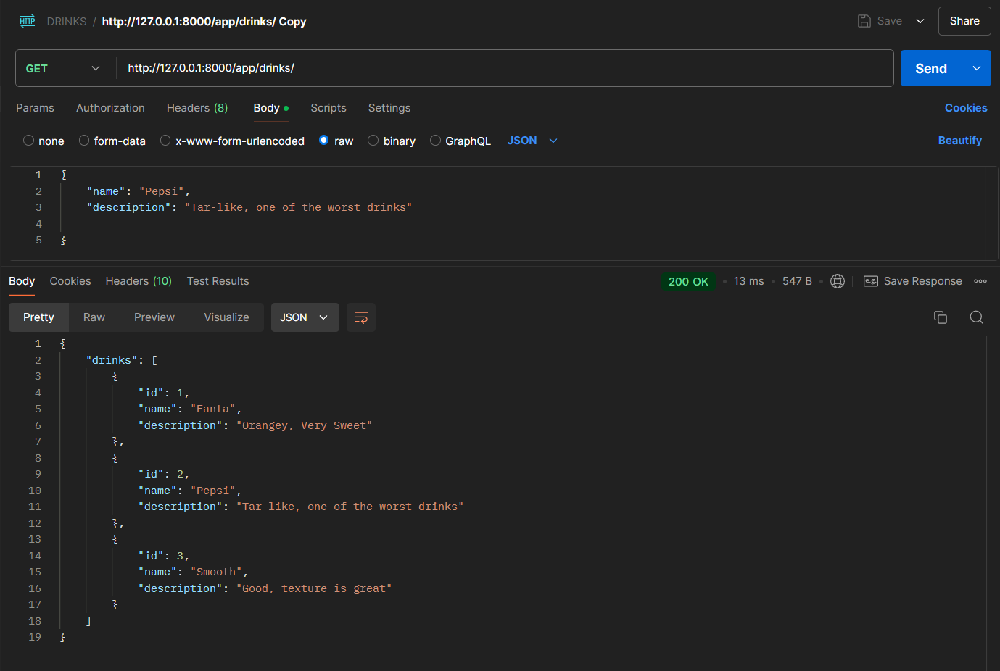
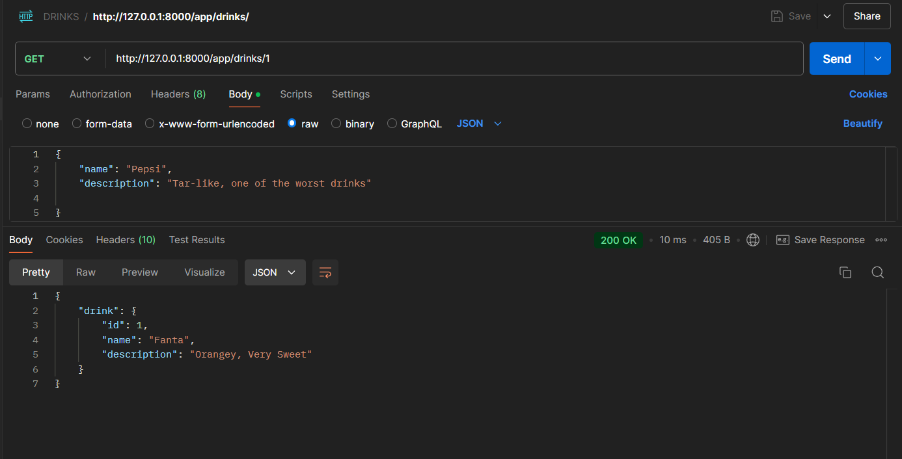
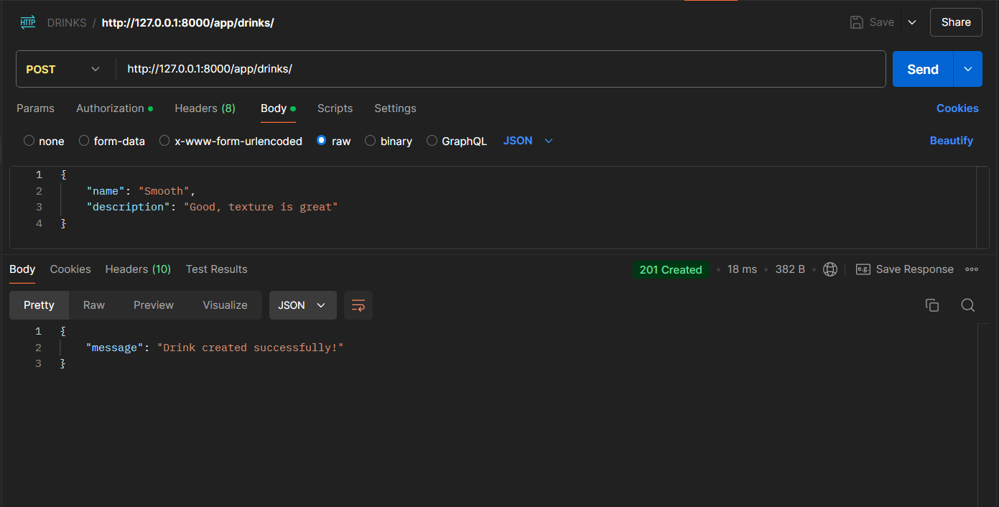

# API Learning with Django Rest Framework

This repository demonstrates learning and practicing API development using Django Rest Framework (DRF). Below are the examples of basic API operations (GET and POST requests).

## 1. GET Request (All Content)

This request fetches all available data.

---

## 2. GET Request (Single Item by ID)

This request fetches a single item based on its ID.

---

## 3. POST Request (Create New Entry)

This request allows you to create a new entry in the database.

